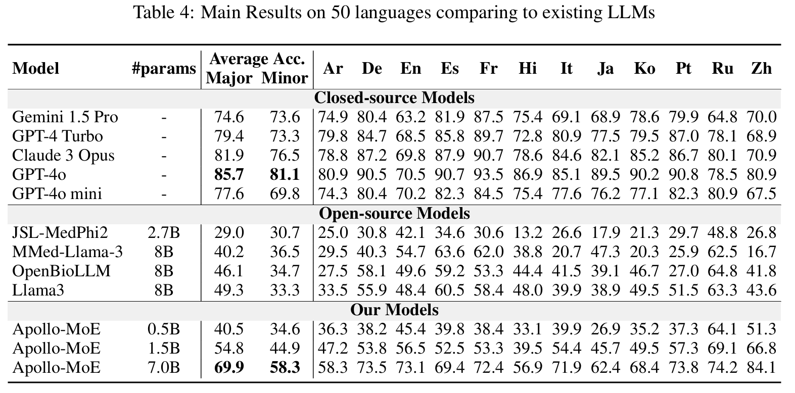
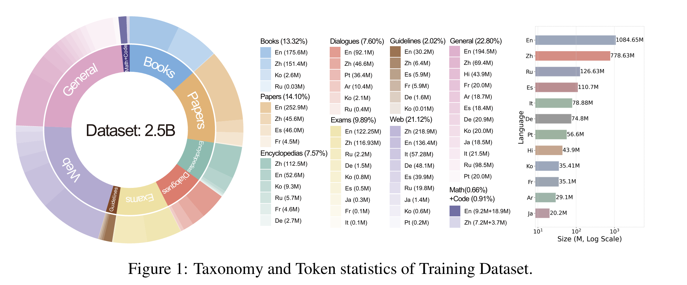

# ApolloMoE: Efficiently Democratizing Medical LLMs for 50 Languages via a Mixture of Language Family Experts

Covering 12 Major Languages including English, Chinese, French, Hindi, Spanish, Arabic, Russian, Japanese, Korean, German, Italian, Portuguese and 38 Minor Languages So far.
<center>


<p align="center">
   📃 <a href="" target="_blank">Paper</a> • 🌐 <a href="" target="_blank">Demo</a> • 🤗 <a href="" target="_blank">ApolloMoEDataset</a> • 🤗 <a href="" target="_blank">Model</a>
</p>

## To do 


## 🌈 Update

* **[2024.10.12]** ApolloMoE repo is published！🎉


## Architecture

<details>
  <summary>Click to view the MoE routing image</summary>

  

</details>

## Results

### Dense
   🤗 <a href="" target="_blank">Apollo2-0.5B</a> • 🤗 <a href="" target="_blank">Apollo2-1.5B</a> • 🤗 <a href="" target="_blank">Apollo2-2B</a>  • 🤗 <a href="" target="_blank">Apollo2-3.8B</a> • 🤗 <a href="" target="_blank">Apollo2-7B</a>  • 🤗 <a href="" target="_blank">Apollo2-9B</a>  
   
<details>
  <summary>Click to view the Dense Models Results</summary>
   
   

</details>

### Post-MoE
   🤗 <a href="" target="_blank">Apollo-MoE-0.5B</a>  • 🤗 <a href="" target="_blank">Apollo-MoE-1.5B</a>  • 🤗 <a href="" target="_blank">Apollo-MoE-7B</a>  
   
<details>
  <summary>Click to view the Post-MoE Models Results</summary>
   
   

</details>
   
   
   

      
   

## Usage Format

- 0.5B, 1.5B, 7B: User:{query}\nAssistant:{response}<|endoftext|>
- 2B, 9B: User:{query}\nAssistant:{response}\<eos\>
- 3.8B: <|user|>\n{query}<|end|><|assisitant|>\n{response}<|end|>

## Dataset & Evaluation

- Dataset
  🤗 <a href="" target="_blank">ApolloMoEDataset</a>

   <details><summary>Click to expand</summary>

    

    - [Data category](https://huggingface.co/datasets/FreedomIntelligence/ApolloCorpus/tree/main/train)


   </details>
   
- Evaluation
  🤗 <a href="https://huggingface.co/datasets/FreedomIntelligence/XMedbench" target="_blank">XMedBench</a> 

   <details><summary>Click to expand</summary>
      
     - EN:
       - [MedQA-USMLE](https://huggingface.co/datasets/GBaker/MedQA-USMLE-4-options) 
       - [MedMCQA](https://huggingface.co/datasets/medmcqa/viewer/default/test)
       - [PubMedQA](https://huggingface.co/datasets/pubmed_qa): Because the results fluctuated too much, they were not used in the paper.
       - [MMLU-Medical](https://huggingface.co/datasets/cais/mmlu)
         - Clinical knowledge, Medical genetics, Anatomy, Professional medicine, College biology, College medicine
     - ZH:
       - [MedQA-MCMLE](https://huggingface.co/datasets/bigbio/med_qa/viewer/med_qa_zh_4options_bigbio_qa/test)
       - [CMB-single](https://huggingface.co/datasets/FreedomIntelligence/CMB): Not used in the paper
         - Randomly sample 2,000 multiple-choice questions with single answer.
       - [CMMLU-Medical](https://huggingface.co/datasets/haonan-li/cmmlu)
         - Anatomy, Clinical_knowledge, College_medicine, Genetics, Nutrition, Traditional_chinese_medicine, Virology
       - [CExam](https://github.com/williamliujl/CMExam): Not used in the paper
         - Randomly sample 2,000 multiple-choice questions


     - ES: [Head_qa](https://huggingface.co/datasets/head_qa)
     - FR:
       - [Frenchmedmcqa](https://github.com/qanastek/FrenchMedMCQA)
       - [MMLU_FR]
         - Clinical knowledge, Medical genetics, Anatomy, Professional medicine, College biology, College medicine
     - HI: [MMLU_HI](https://huggingface.co/datasets/FreedomIntelligence/MMLU_Hindi)
        - Clinical knowledge, Medical genetics, Anatomy, Professional medicine, College biology, College medicine
     - AR: [MMLU_AR](https://huggingface.co/datasets/FreedomIntelligence/MMLU_Arabic)
        - Clinical knowledge, Medical genetics, Anatomy, Professional medicine, College biology, College medicine
     - JA: [IgakuQA](https://github.com/jungokasai/IgakuQA)
     - KO: [KorMedMCQA](https://huggingface.co/datasets/sean0042/KorMedMCQA)
     - IT:
       - [MedExpQA](https://huggingface.co/datasets/HiTZ/MedExpQA)
       - [MMLU_IT]
         - Clinical knowledge, Medical genetics, Anatomy, Professional medicine, College biology, College medicine
     - DE: [BioInstructQA](https://huggingface.co/datasets/BioMistral/BioInstructQA): German part
     - PT: [BioInstructQA](https://huggingface.co/datasets/BioMistral/BioInstructQA): Portuguese part
     - RU: [RuMedBench](https://github.com/sb-ai-lab/MedBench)

      
      


   </details>

   
## Results reproduction
   <details><summary>Click to expand</summary>

   
   We take Gemma-2b as example
   1. Download Dataset for project:

      ```
      bash 0.download_data.sh
      ```
    
   2. Prepare test and dev for specific model:

      
      - Create test data for with special token, you can use ./util/check.ipynb to check models' special tokens
        
       ```
       bash 1.data_process_test&dev.sh
       ```
    
   3. Prepare train data for specific model (Create tokenized data in advance):

    
      - You can adjust data Training order and Training Epoch in this step

       ```
       bash 2.data_process_train.sh
       ```
    
   4. Train the model

    
      - If you want to train in Multi Nodes please refer to ./scripts/multi_node_train_*.sh


       ```
       bash 3.single_node_train_gemma.sh
       ```


   5. Evaluate your model: Generate score for benchmark
      
         ```
         bash 4.eval.sh
         ```

   6. Evaluate your model: Play with your ckpts in bash
    
         ```
         python ./src/evaluate/cli_demo.py --model_name='./ckpts/your/path/tfmr'
         ```
   
   </details>


##  Citation
Please use the following citation if you intend to use our dataset for training or evaluation:

```

```

